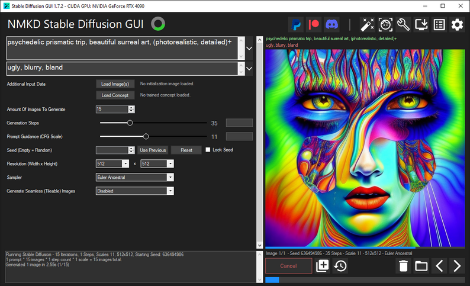
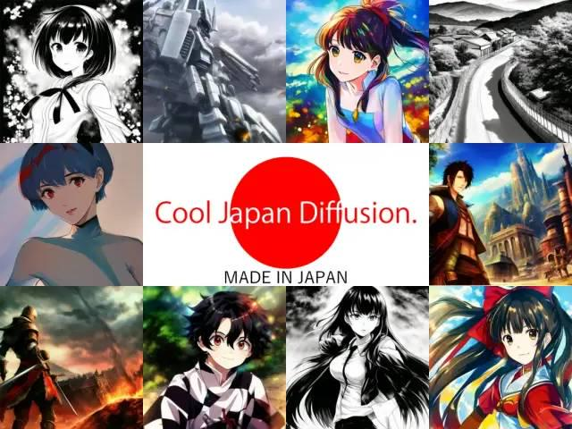
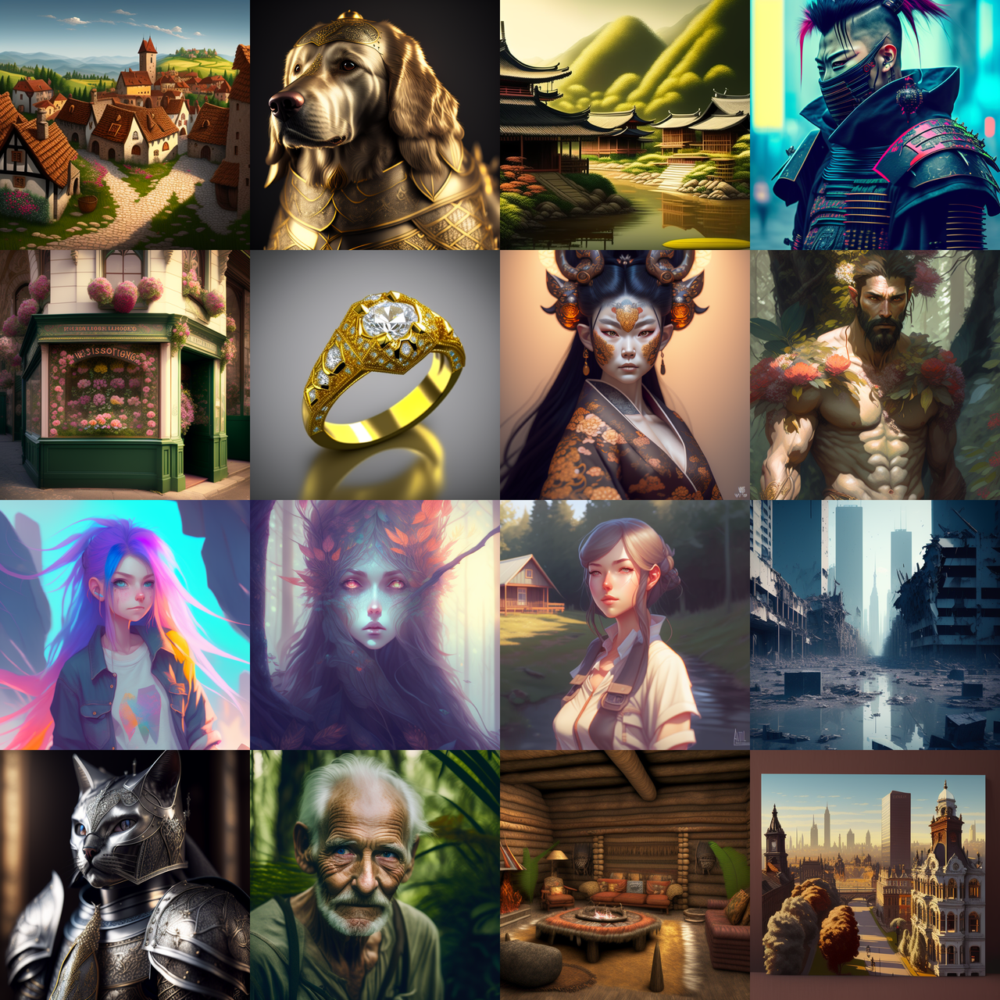
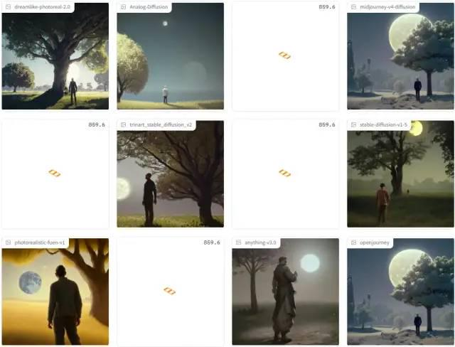
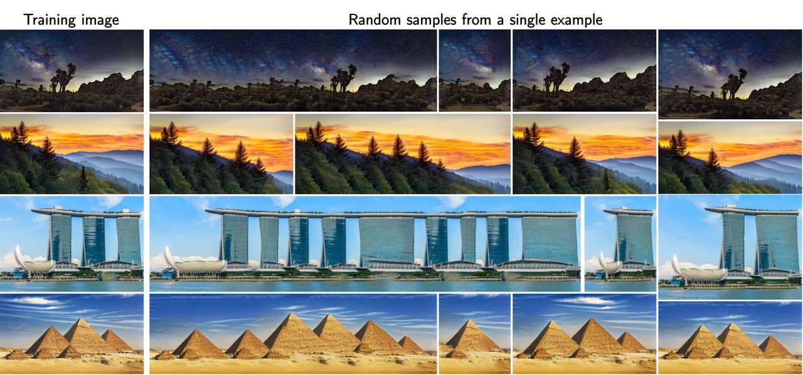
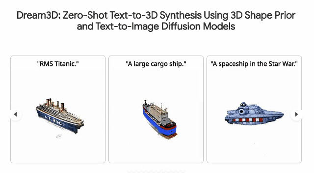
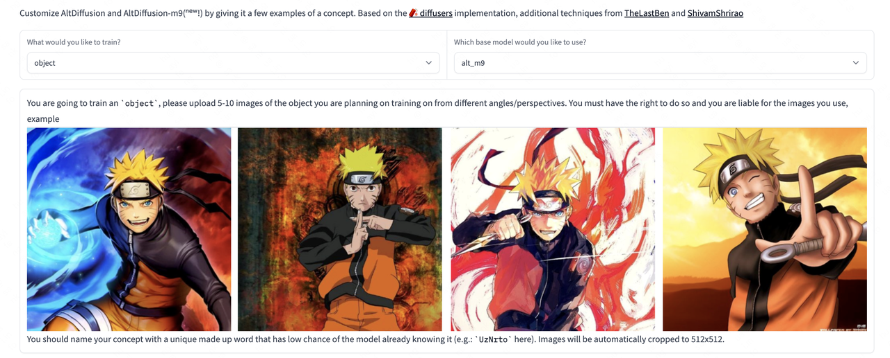
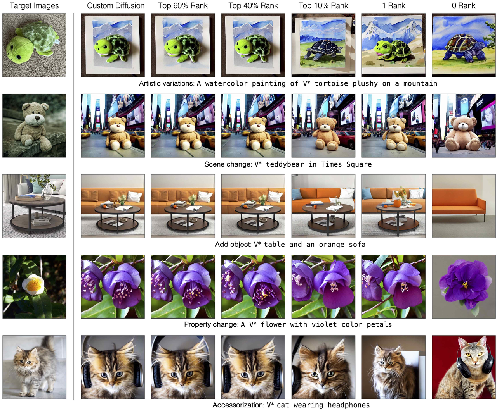
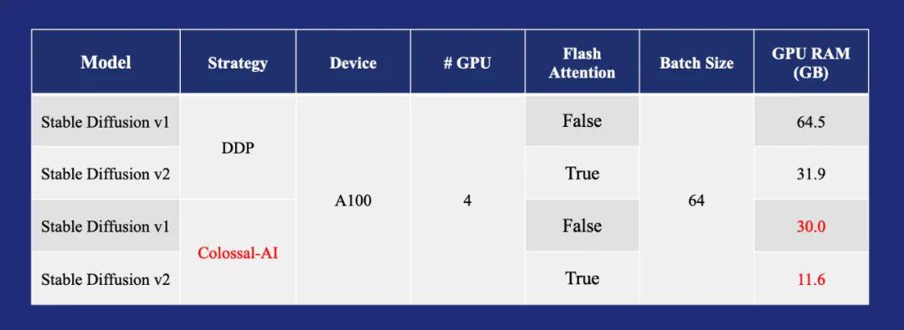
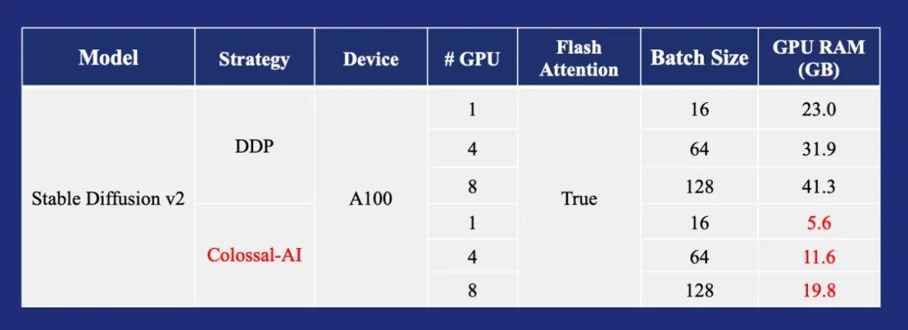

目前有大量的平台推出了 AI 绘画的能力，这里做一个汇总。

## 1. 可使用绘画的平台
### 📪 国外

|Name                   | Tags   |URL                                                                                                                       |
|-----------------------|-----------|-----------------------------------------------------------------------------------------------------------|
|midjourney             |新用户免费20次|[地址](https://www.midjourney.com/)                                                                                                    |
|wombo.art              |免费      |[地址](https://app.wombo.art/)                                                                                                         |
|Google Colab           |免费      |[地址](https://colab.research.google.com/github/huggingface/notebooks/blob/main/diffusers/stable_diffusion.ipynb#scrollTo=yEErJFjlrSWS)|
|DALL·E 2               |排队申请    |[地址](https://openai.com/dall-e-2/)                                                                                                   |
|artbreeder             |免费      |[地址](https://www.artbreeder.com/beta/collage)                                                                                        |
|dreamstudio            |200点数   |[地址](https://beta.dreamstudio.ai/)                                                                                                   |
|nightcafe              |-       |[地址](https://creator.nightcafe.studio/create/text-to-image?algo=stable)                                                              |
|starryai               |-       |[地址](https://create.starryai.com/my-creations)                                                                                       |
|webui                  |免费      |[地址](https://colab.research.google.com/github/altryne/sd-webui-colab/blob/main/Stable_Diffusion_WebUi_Altryne.ipynb)                 |
|替换图片                   |免费      |[地址](https://colab.research.google.com/drive/1R2HJvufacjy7GNrGCwgSE3LbQBk5qcS3?usp=sharing)                                          |
|webui-AUTOMATIC1111版本  |免费      |[地址](https://colab.research.google.com/drive/1Iy-xW9t1-OQWhb0hNxueGij8phCyluOh)                                                      |
|生成视频                   |免费      |[地址](https://github.com/THUDM/CogVideo)                                                                                              |
|PS插件-绘画生成图片            |-       |[地址](https://www.nvidia.com/en-us/studio/canvas/)                                                                                    |
|3D模型                   |免费      |[地址](https://colab.research.google.com/drive/1u5-zA330gbNGKVfXMW5e3cmllbfafNNB?usp=sharing)                                          |
|[elbo](https://art.elbo.ai/lbo)|-       |[地址](https://art.elbo.ai/)                                                                                                           |
|deepdreamgenerator|-       |[地址](https://deepdreamgenerator.com/)                                                                                                           |
|big-sleep|免费       |[地址](https://github.com/lucidrains/big-sleep/)                                                                                                           |
|nightcafe|-       |[地址](https://nightcafe.studio/)                                                                                                           |
|craiyon|-       |[地址](https://www.craiyon.com/)                                                                                                           |
|novelai|-       |[地址](https://novelai.net/)                                                                                                          |
|novelai 免费版|免费 |[地址](https://github.com/JingShing/novelai-colab-ver) |
|Sd-Outpainting|免费 |[地址](https://github.com/lkwq007/stablediffusion-infinity) |
|TyPaint|免费 |[地址](https://apps.apple.com/us/app/typaint-you-type-ai-paints/id1624024392) |
|PicSo|新用户每天免费10次 |[地址](https://picso.ai/) |
|sd-outpaing|免费 |[地址](https://github.com/lkwq007/stablediffusion-infinity) |
|novelai-colab 版本|免费 |[地址](https://github.com/acheong08/Diffusion-ColabUI) |
|novelai-colab 版本2|免费 |[地址](https://github.com/JingShing/novelai-colab-ver) |

### 🚴🏻 国内
|Name                                                      | 价格  |URL                                                                                          |
|--------------------------------------------------------------------|----|---------------------------------------------------------------------------------------------|
|文心大模型                                                  |暂时免费|[地址](https://wenxin.baidu.com/moduleApi/ernieVilg)                                                 |
|文心-一格                                                   |暂时免费|[地址](https://yige.baidu.com/)                                                                   |
|6pen                                                       |部分免费|[地址](https://6pen.art/)                                                         |
|MewxAI人工智能                                              | 免费 | 微信小程序                                            |
|MuseArt                                                    |付费 + 看广告|[微信小程序搜 MuseArt](https://link.zhihu.com/?target=https%3A//www.feishu.cn/invitation/page/add_contact/%3Ftoken%3Ddd8o7895-6809-42b5-9509-fe7d1c33216c) |
|大画家Domo                                                  |-   |[地址](https://www.domo.cool/)                                                                       |
|盗梦师                                                      |有免费次数 + 付费   |微信小程序搜盗梦师                                                                                          |
|画几个画                                                     |-   |微信小程序搜画几个画                                                                                          |
|Niko绘图                                                    |免费 + 看广告 |微信小程序搜Niko绘图                                                                                          |
|飞链云AI绘画版图                                              |免费 |[地址](https://ai.feilianyun.cn/) |
|[Freehand意绘](https://freehand.yunwooo.com/)                |免费 |[地址](https://freehand.yunwooo.com/)|
|即时AI                                                       |免费 |[地址](https://js.design/pluginDetail?id=6322a4ab0eededcff6ba451a)|
|意见AI绘画                                                    |有免费次数 + 付费  |微信小程序搜意见AI绘画|
|PAI                                                          |免费 |[地址](https://artpai.xyz/)|
|爱作画                                                        | 有免费次数 + 付费 |[地址](https://aizuohua.com/)|
|皮卡智能AI                                                    | 免费 |[地址](https://www.picup.shop/text2image.html#/) |
|云景AI绘图                                                     | 免费 |[地址](https://yunjing.gallery) |

### 模型下载

1. [novelAI](https://huggingface.co/acheong08/secretAI/resolve/main/stableckpt/animefull-final-pruned/model.ckpt)

2. [stable_diffusion](https://huggingface.co/CompVis/stable-diffusion-v-1-4-original/resolve/main/sd-v1-4.ckpt)

3. [waifu_diffusion](https://huggingface.co/hakurei/waifu-diffusion-v1-3/resolve/main/wd-v1-3-float32.ckpt)

4. [sd-v1-5](https://huggingface.co/runwayml/stable-diffusion-v1-5/resolve/main/v1-5-pruned-emaonly.ckpt)

## 2. 使用教程

### Stable Diffusion（推荐）

[用Colab免费部署自己的AI绘画云平台—— Stable Diffusion](https://mp.weixin.qq.com/s/2H1gCoOVBK89dIhEqoTQmA)

[AI数字绘画 stable-diffusion 保姆级教程](https://mp.weixin.qq.com/s/nDnQuZn3hVgrwqWVada2cw)

### Disco Diffusion

[最简单全面本地运行Colab及Disco Diffusion教程](https://www.bilibili.com/read/cv16202697)

[人工智能绘画工具 Disco Diffusion 入门教程](https://www.zcool.com.cn/article/ZMTM3OTg3Mg==.html)

[一条录制的Disco Diffusion 生成器教程的内容](https://weibo.com/5519581673/LnZuxbAC8?type=repost)

[堪比艺术家！被疯狂安利的 AI 插画神器 Disco Diffusion 有多强？](https://www.uisdc.com/disco-diffusion)

[用AI如何画概念图？](https://www.shangyexinzhi.com/article/4648362.html)

**归档请查看：[🩹 使用教程](https://www.notion.so/qiufeng/82ee94888cf748eba20b5adb64d0bde7)**

## 3. 自建教程

### GPU场景推荐

[https://www.autodl.com/createInstance](https://www.autodl.com/createInstance)

[http://gpu.ai-galaxy.cn/store](http://gpu.ai-galaxy.cn/store)

### 显卡选择

[时代变了，大人：RTX 3090时代，哪款显卡配得上我的炼丹炉？](https://zhuanlan.zhihu.com/p/225507448)

### 自建教程

[人人都能用的「AI 作画」，如何把 Stable Diffusion 装进电脑？](https://mp.weixin.qq.com/s/jL4m4e-A1oc44Z8PLyvA2A)

[https://github.com/fboulnois/stable-diffusion-docker](https://github.com/fboulnois/stable-diffusion-docker)

[https://github.com/AbdBarho/stable-diffusion-webui-docker](https://github.com/AbdBarho/stable-diffusion-webui-docker)

### MAC自建

[Run](https://replicate.com/blog/run-stable-diffusion-on-m1-mac)

[https://github.com/divamgupta/diffusionbee-stable-diffusion-ui](https://github.com/divamgupta/diffusionbee-stable-diffusion-ui)

**归档请查看：[🕙 自建教程](https://www.notion.so/qiufeng/d2a6f57d5ee048d3b7b84bf331845b69)**

## 4. 调参教程

### NovelAI专属

Novel AI 元素魔法全收录 https://docs.qq.com/doc/DWHl3am5Zb05QbGVs

http://wolfchen.top/tag/

https://aitag.top/  

https://tags.novelai.dev/

元素法典——Novel AI 元素魔法全收录: https://docs.qq.com/doc/DWHl3am5Zb05QbGVs

NovelAI 法术解析: https://spell.novelai.dev/

### DD关键词

[Disco Diffusion](https://www.notion.so/Disco-Diffusion-d8a78d7a5a8b40238da820687615dee6) 

### SD 关键词

[https://arthub.ai/](https://arthub.ai/)

[https://lexica.art/](https://lexica.art/) 

[https://www.krea.ai/?continueFlag=6591d07b3186f4c7e58de1a4bcfaefb0](https://www.krea.ai/?continueFlag=6591d07b3186f4c7e58de1a4bcfaefb0)

[https://promptomania.com/stable-diffusion-prompt-builder/](https://promptomania.com/stable-diffusion-prompt-builder/)

### MJ关键词

[https://prompt.noonshot.com/midjourney](https://prompt.noonshot.com/midjourney)

[https://huggingface.co/spaces/doevent/prompt-generator](https://huggingface.co/spaces/doevent/prompt-generator)

[https://midjourney-prompt-helper.netlify.app/](https://midjourney-prompt-helper.netlify.app/)

### 法术解析

https://spell.novelai.dev/

Deep Danbooru：

http://dev.kanotype.net:8003/deepdanbooru/

http://www.prompttool.com/

**归档请查看：[🎨 调参教程](https://www.notion.so/qiufeng/f003f8cb134542dd9d637bb5b5addf1f)**

## 5. 新闻资料（周更）

2023.1.1 - 2023.1.7

### Windows GUI 工具

https://nmkd.itch.io/t2i-gui

### 绝对纯净的二次元生成模型

https://huggingface.co/aipicasso/cool-japan-diffusion-2-1-0-beta

### 新的高质量模型

https://huggingface.co/22h/vintedois-diffusion-v0-1

### Maximum Diffusion

同时运行12个模型，进行对比

https://huggingface.co/spaces/Omnibus/maximum_diffusion

### 一张图进行训练

使用 SinDDM，可以从单个自然图像训练生成模型，然后从给定的图像生成随机样本

https://github.com/fallenshock/SinDDM

### 腾讯领衔 TextTo3D

目前还没有代码

https://bluestyle97.github.io/dream3d/

### iOS APP 直接跑 Stable Diffusion 2.0

https://github.com/ynagatomo/ImgGenSD2

### 支持9种语言的多语言图像到文本模型

https://huggingface.co/spaces/BAAI/dreambooth-altdiffusion

### 新的训练方式 custom-diffusion

类似 dreambooth

https://github.com/adobe-research/custom-diffusion

### 碎片感的模型

https://huggingface.co/Stkzzzz222/fragments_V2

### 降低训练成本框架 Colossal-AI

https://mp.weixin.qq.com/s/IdK0XLitqfu0iPGqHnNQzw

**更多汇总请查看 👉  [新闻资料](https://github.com/hua1995116/awesome-ai-painting/tree/master/%E6%96%B0%E9%97%BB%E8%B5%84%E6%96%99)**

## 6. 其他

[img2img记录](https://www.notion.so/img2img-f3ef70c4b67c49d1b7a15fca91955eaa)

[AI视频](https://www.notion.so/AI-2b14076b2b1e4ef9b68a68924f716905)

[Koishi.js 聊天机器人 NovelAI 插件](https://bot.novelai.dev/)

[将 pt 格式的训练模型文件转换为 png 格式](https://colab.research.google.com/gist/wfjsw/2b2a26349bef1ce891f6ab4d4fb3030a/convert-pt-embedding-to-png.ipynb)
